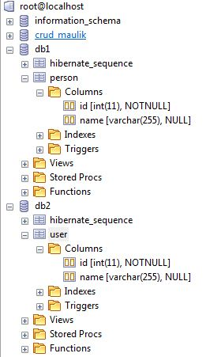
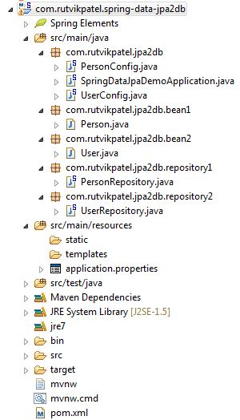
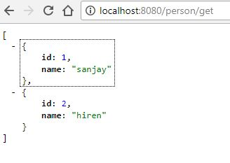
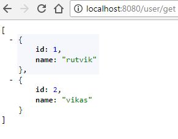
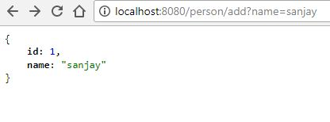
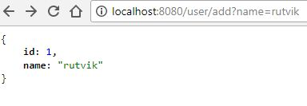

# spring-data-jpa-2db

Spring Boot, Spring Data JPA - 2 DB connection in 1 Project Example

> In this tutorial you will know how to create Spring boot application with 2 db connection with spring data jap.

### Database Structure

### Project Structure

### Service call output

# That's it... you are ready to run

> Download & Import Project > Right Click on Project > Run As > Spring Boot Application

## Meta

Rutvik Patel - rrpatel003@gmail.com

Distributed under the GPL V3.0 license. See ``LICENSE`` for more information.
